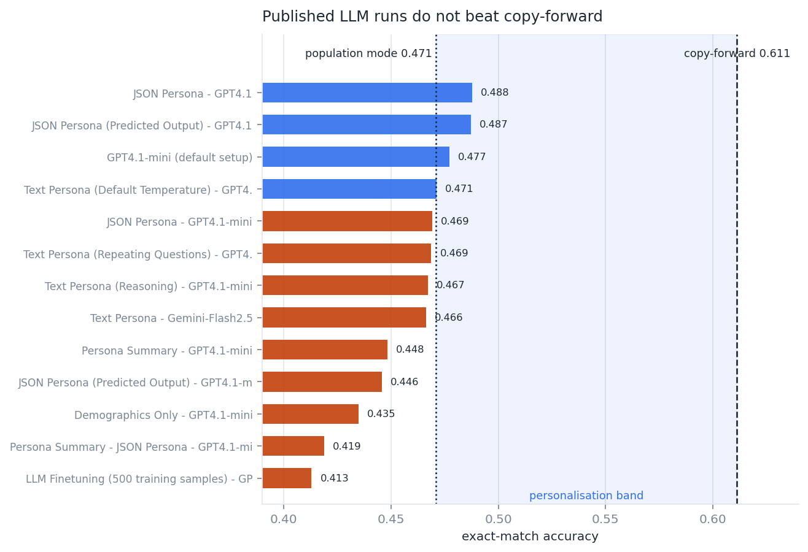
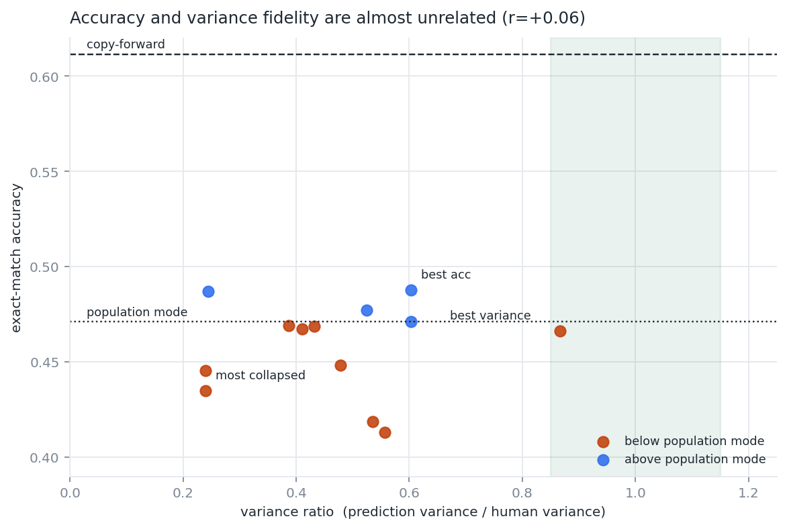

# Twin-2K-500 Large Behavior Model Submission

This repository is for Building a Large Behavior Model on Twin-2K-500: given a person's
wave 1-3 answers as their persona, predict that same person's wave-4 answers and evaluate
against the real wave-4 answers and the human test-retest reference.

## Reports

| # | Report | Contents |
|---|---|---|
| 1 | [`reports/01_data_exploration.md`](reports/01_data_exploration.md) | dataset structure, HF subsets, question types, test-retest, leakage, representativeness |
| 2 | [`reports/02_modeling_plan.md`](reports/02_modeling_plan.md) | model choice, training route, data construction, splits, model selection |
| 3 | [`reports/03_evaluation_strategy.md`](reports/03_evaluation_strategy.md) | metrics, comparators, train/test protocol, leakage controls, acceptance criteria |
| 4 | [`reports/04_business_applications.md`](reports/04_business_applications.md) | business uses, guardrails, prohibited uses |
| 5 | [`reports/05_maintenance.md`](reports/05_maintenance.md) | monitoring, drift, retraining triggers, versioning, governance |
| 6 | [`reports/06_prototype.md`](reports/06_prototype.md) | prototype design, commands, result, validation checks, scope |

Additional generated data exploration reports for target structure, leakage, LLM baselines, persona length, representativeness, and comparator baselines are in [`reports/exploration/`](reports/exploration/01_structure_and_retest.md).

## Key Findings

- All 126 wave-4 target columns already appear in waves 1-3; the benchmark is repeated-item prediction, not unseen-question generalization.
- Because of that, copy-forward and human test-retest are the same 0.612 reference line.
- `full_persona` contains wave-4 answers for repeated items; modelling inputs must come from `wave_split`.
- The prototype improves over the untuned base but remains below population mode, so it validates the pipeline rather than model quality.

## Key Results

The main quantitative results are documented in Reports 1, 3, and 6. The two figures below summarize the central baseline comparison and the accuracy-vs-distribution tradeoff.





Short version:

- population mode baseline: 0.471 accuracy;
- copy-forward / human test-retest reference: 0.612 accuracy;
- best shipped LLM result re-scored from dataset artifacts: 0.488 accuracy;
- prototype fine-tuned SmolLM2-135M result: 0.485 accuracy on its 105-column slice.

## Repository Layout

```text
src/                       analysis scripts that regenerate reports/exploration, figures, and derived CSVs
poc/                       lightweight prototype: dataset build, train, evaluate, result JSON
tests/test_no_leakage.py   leakage and split guardrails for the prototype path
reports/                   six submission reports
reports/exploration/       generated data exploration appendices
figures/                   generated plots used by the reports
data/derived/              committed derived CSVs
data/raw/                  Twin-2K-500 snapshot, gitignored
```

## Data

The raw dataset is not committed. Download it into `data/raw`:

```bash
python -m venv .venv
.venv/bin/pip install -r requirements.txt
.venv/bin/python -c "from huggingface_hub import snapshot_download; snapshot_download('LLM-Digital-Twin/Twin-2K-500', repo_type='dataset', local_dir='data/raw')"
```

The analysis expects these dataset folders under `data/raw`:

```text
question_catalog_and_human_response_csv/
wave_split/
full_persona/
LLM_simulation_results/csv_formatted/
```

## Reproduce Analysis Reports

```bash
for s in src/0*.py; do .venv/bin/python "$s"; done
.venv/bin/python tests/test_no_leakage.py
```

Outputs:

```text
reports/exploration/*.md
data/derived/*.csv
figures/*.png
```

## Run Prototype

```bash
.venv/bin/python poc/build_dataset.py
.venv/bin/python tests/test_no_leakage.py
.venv/bin/python -u poc/train.py --arm held_out --n-train 10000 --batch-size 16 --device cuda
.venv/bin/python -u poc/evaluate.py --arm held_out --n-test 0 --batch-size 32 --device cuda
```

The reported prototype result is in [`poc/results_held_out.json`](poc/results_held_out.json) and is summarized in [`reports/06_prototype.md`](reports/06_prototype.md). It was run on a Colab T4; CPU execution is possible but slow.

## Notes

- `full_persona` is audited for leakage but is not a legal model input.
- The prototype is a pipeline validation artifact, not the proposed full LBM.
- The full build and evaluation plan are in Reports 2 and 3.

## If Time Allowed, I Would Prioritize

- Build the S2 block-held-out split and commit fixed split files, because wave 4 contains no truly new items.
- Add an IRT / low-rank baseline, because the task is partly a response-matrix completion problem.
- Evaluate treatment-effect recovery on the between-subject experiments, because that is closest to the business use case.
- Add binary option-order robustness to the prototype scorer.
- Re-run the shipped GPT-4.1 / Gemini baselines from pinned prompts and model versions if treating them as more than reference artifacts.
