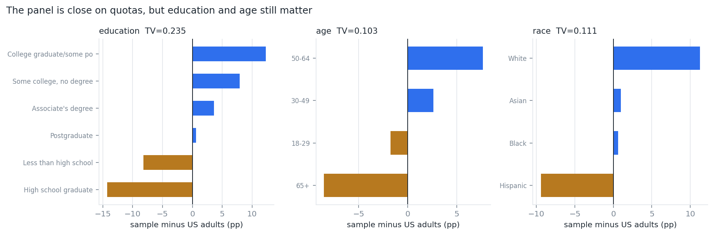

# Twin-2K-500 — Large Behavior Model

Research Engineer take-home. The goal is to design a credible Large Behavior Model (LBM)
on [Twin-2K-500](https://huggingface.co/datasets/LLM-Digital-Twin/Twin-2K-500): given a
person's wave 1-3 answers as their persona, predict that same person's held-out wave-4
answers, then evaluate against both the real wave-4 answers and the human test-retest
reference line.

The top-level README is the intended entry point for the GitHub submission. It explains
the main findings, where each deliverable lives, and how to run the code. The repo is
organised around four steps:

1. Explore what the prediction target actually contains.
2. Define leakage-safe inputs and baselines.
3. Propose a model plan and evaluation strategy.
4. Prototype one small, honest version of the loop.

## Evaluation rubric mapping

| What is evaluated | Where this repo addresses it |
|---|---|
| **Data sense** | `reports/01_data_exploration.md` indexes the exploration: wave 4 is entirely repeated items, `full_persona` is a leakage trap, legal personas are long, and the panel is skewed. |
| **Technical judgment** | `reports/02_modeling_plan.md` proposes a modelling ladder: cheap psychometric baselines first, retrieval prompting second, fine-tuning only when it adds value. |
| **Rigor on evaluation** | `reports/03_evaluation_strategy.md` starts with comparators, not metrics: population mode, demographic-cell mode, kNN, copy-forward, human test-retest, shipped LLMs. `reports/exploration/06_comparator_baselines.md` computes the cheap B2/B3 baselines. |
| **Communication and honesty** | The README reports negative POC results directly; `Honest limitations` lists what was specified but not verified. |
| **Bonus code quality** | `src/` regenerates reports and figures; `poc/` builds a leakage-checked slice, trains, and evaluates; `tests/test_no_leakage.py` is runnable before trusting any number. |

---

## Start here: four findings that shape the design

Everything else in this repo follows from these. All are reproduced by `src/`.

### 1. The evaluation target is 100% repeated questions

All 126 wave-4 columns already appear in waves 1–3. **Zero are new.** There is no
unseen-question generalisation set in this benchmark — so it cannot, by itself, distinguish
a behaviour model from a lookup table.

### 2. The human test-retest line and copy-forward baseline are the same number

Human test–retest agreement is **0.612** (95% CI 0.608–0.615). Chance-corrected,
**κ = 0.447** (defined on 110 of 126 columns; κ does not exist for continuous support).

But test–retest is `P(wave-4 answer == the same person's earlier answer)`, and copy-forward
prediction is `predict wave-4 with that earlier answer`. **One computation, two names.** So
the evaluation has to report both meanings clearly: it is the assignment's human
test-retest reference, and also the strongest simple repeated-item baseline.

It also follows that the ceiling is *not* an upper bound. A human re-test draw carries
occasion noise; a model predicting the conditional mode does not. A genuinely good model
should *exceed* it.

### 3. The entire personalisation band is 14 accuracy points

| Baseline | accuracy |
|---|---:|
| Population mode (no personalisation at all) | 0.471 |
| Copy-forward (= test–retest reference line) | 0.612 |

**Band = 0.140, 95% CI [0.137, 0.144].** Narrow, but it excludes zero comfortably — the
signal is real, just small. Every claimed improvement should be quoted against a band of
this width, not against 0–100%.

### 4. Existing LLM runs leave substantial headroom


| Specification | LLM acc | copy-fwd | pop-mode | Δ vs copy-fwd | var ratio |
|---|---:|---:|---:|---:|---:|
| JSON Persona – GPT4.1 | 0.488 | 0.611 | 0.471 | −0.124 | 0.60 |
| GPT4.1-mini (default) | 0.477 | 0.612 | 0.471 | −0.134 | 0.53 |
| Text Persona – Gemini-Flash2.5 | 0.466 | 0.612 | 0.471 | −0.145 | 0.87 |
| Demographics Only – GPT4.1-mini | 0.435 | 0.612 | 0.471 | −0.177 | 0.24 |
| **LLM Finetuning (500 samples)** | **0.413** | 0.614 | 0.471 | −0.201 | 0.56 |

Only **4 of 13** beat the population mode at all, and the best does so by just +0.016 -
**12% of the available band**. Nine score below it, five by more than 0.02. The fine-tuned
system is the worst at −0.058: materially worse than ignoring the persona entirely.
(14 result folders ship, but two are byte-identical runs, so 13 distinct systems.)

A cheap response-vector kNN baseline, added as B3 in `reports/exploration/06_comparator_baselines.md`, scores **0.486**.
That is essentially tied with the best shipped LLM run (**0.488**) while using no language
model at all. This is the strongest evidence that the modelling ladder should start with
psychometric / matrix-completion baselines rather than jumping straight to an LLM.

Important caveat: the GPT-4.1 / GPT4.1-mini / Gemini rows are **not rerun API calls**.
They are re-scored from the prediction CSVs shipped with the dataset. I verified the
scoring logic locally, but I did not verify that a fresh API run today would reproduce the
same predictions. If the published artifacts differ from a clean rerun, that would change
the interpretation of the LLM comparison.


Median variance ratio is **0.48**: simulated populations are half as dispersed as real ones,
and only 1 of 13 clears 0.85. The decisive number is a null result — the correlation between
accuracy and variance ratio is **r = +0.06**. **Accuracy carries no information about
whether the simulated population is correctly dispersed**, so it has to be measured and
gated separately rather than inferred from a leaderboard.

---

## Leakage-safe task definition

`full_persona` — the first config listed, the one whose name implies "everything we know
about this person" — **contains the wave-4 ground truth.** The dataset README says so, in a
line that is easy to skim past:

> For questions that appear in both waves 1-3 and wave 4, the wave 4 responses are used.

Audited over 300 participants and 18,900 question-participant pairs: **100.000%** of wave-4
questions in `full_persona.persona_json` carry the exact wave-4 answer. Anyone prompting
with it and scoring on wave 4 is measuring string retrieval.

A second trap sits in the dataset README's own usage snippet, where prompt input and ground
truth are the same field (`wave4_Q_wave4_A`) and the fix is easy to miss.

Full audit — including split granularity, between-subject structure, and pretraining
contamination — in [`reports/exploration/02_leakage_audit.md`](reports/exploration/02_leakage_audit.md).
Enforcement is in [`tests/test_no_leakage.py`](tests/test_no_leakage.py), which breaks the
build rather than relying on review. **It has already caught one real bug** in this repo's
own POC prompt construction.

**Tripwire:** any accuracy above ~0.75 on repeated items should trigger a leakage audit.
Humans only agree with themselves 0.612 of the time.

---

## Who this panel is



Quota-matched on sex (TV = 0.001) and region (0.028), but badly skewed on **education
(TV = 0.235)** — "less than high school" is 0.8% of the panel against ~9% of US adults, and
65+ is under-represented by 8.5pp. The least-educated decile of the country is effectively
absent, and cognitive/heuristics items — the entire wave-4 evaluation set — are exactly the
measures most sensitive to that.

Combined with the 0.48 variance ratio, minority positions are compressed twice: once by who
was sampled, once by the model's pull toward the modal answer.

---

## Deliverables

| # | Deliverable | Where |
|---|---|---|
| 1 | Data exploration report | [`reports/01_data_exploration.md`](reports/01_data_exploration.md), indexing generated appendices in [`reports/exploration/`](reports/exploration/01_structure_and_retest.md) |
| 2 | Plan to build the model | [`reports/02_modeling_plan.md`](reports/02_modeling_plan.md) |
| 3 | Evaluation strategy | [`reports/03_evaluation_strategy.md`](reports/03_evaluation_strategy.md) |
| 4 | Business applications | [`reports/04_business_applications.md`](reports/04_business_applications.md) |
| 5 | Long-run maintenance | [`reports/05_maintenance.md`](reports/05_maintenance.md) |
| 6 | Proof-of-concept code | [`poc/build_dataset.py`](poc/build_dataset.py), [`poc/train.py`](poc/train.py), [`poc/evaluate.py`](poc/evaluate.py), [`poc/results_held_out.json`](poc/results_held_out.json) |

### Headlines from each

**Plan (2).** The task splits into three capabilities: denoise (C1), generalise to unseen
items (C2), preserve the distribution (C3). Only C1 is measurable on the shipped benchmark;
C2 and C3 are where the value is. Recommended build order puts a **classical
IRT/low-rank baseline first** — the response matrix is 2,058 × 760 and this is a
matrix-completion problem that psychometrics already solves — on the explicit hypothesis
that it beats the LLMs at a fraction of the cost. `reports/03_evaluation_strategy.md` §6 states what
would falsify that.

On context: a legal persona measures **27,484 tokens** median with a real BPE tokenizer
(the chars/4 rule of thumb understates it by 15%). The shipped `persona_summary` compresses
that 7x to 3.2k — and scores *worse*, so compression is not free. Retrieval by construct is
the recommended lever, and it is the only option that fits a <0.5B context window.

**Evaluation (3).** Comparator ladder before metrics. The implemented ladder is:
population mode 0.471, demographic-cell mode 0.467, kNN response-vector 0.486,
copy-forward/test-retest 0.612, and the best shipped LLM 0.488. Per-question-type metrics
(κ for binary, MAE for ordinal, normalised MAE for continuous), distribution-level metrics
as ship blockers, participant-level bootstrap everywhere, and explicit pre-registered
acceptance criteria. Every model is evaluated against real wave-4 answers and the
test-retest/copy-forward reference line.

**Business (4).** The defensible product is survey pre-testing and experiment design —
a screening tool, always validated on humans. Prohibited: any decision about a named
individual, replacing human subjects in confirmatory research, speaking for
under-represented groups. The realistic catastrophic failure is not a bad prediction, it is
simulated data entering a real analysis pipeline undetected.

**Maintenance (5).** The drift that actually bites is the base model being silently
swapped, not human behaviour changing. Pin every version; run a 200-pair canary on each
deploy; quarterly mini-waves are the only thing that measures correctness rather than
self-consistency.

---

## POC results (deliverable 6)

The reported POC result is a single Colab T4 run, not a comparison against a separate local
run. It is intentionally **not** the proposed Large Behavior Model. The proposed real
system in `reports/02_modeling_plan.md` uses a 7B/8B-class base model plus retrieval or a
learned trait vector. The POC uses SmolLM2-135M because the bonus asks for a tiny prototype,
and because a free Colab T4 can run it end-to-end quickly enough to validate the data
pipeline, leakage controls, comparator ladder, and evaluation code.

The POC fine-tunes SmolLM2-135M on the `held_out` arm: for each test example, the target
item and its near-duplicates are removed from that person's prompt, so copying that
person's earlier answer is impossible. This is a **no-copy repeated-item POC**, not the S2
block-held-out generalisation split proposed in the evaluation plan: the target columns
themselves are still present in training examples for other participants. Configuration:
10,000 training examples, 1 epoch, full evaluation on 33,329 held-out test pairs over 411
participants.

| System | accuracy | var ratio | collapsed |
|---|---:|---:|---:|
| B1 population mode | 0.5397 | 0.00 | 100.0% |
| B4 copy-forward (= retest line) | 0.6936 | 1.00 | 0.0% |
| base model, untuned | 0.3633 | 0.00 | 96.2% |
| **fine-tuned** | **0.4854** | **0.26** | **19.0%** |

"Collapsed" = share of columns given one constant answer for every participant. Bootstrap CIs
over participants, 400 resamples:

| Comparison | 95% CI |
|---|---|
| fine-tuned vs base | **[+0.111, +0.132]** |
| fine-tuned vs B1 population mode | [−0.061, −0.048] |
| fine-tuned vs B4 copy-forward | [−0.216, −0.200] |

Scope note: these POC numbers are on a 105-column binary/short-ordinal slice where a
single digit is a faithful target. The main exploration baseline of population mode =
0.471 is on all 126 wave-4 columns. The POC population mode = 0.5397 is therefore not the
same test set and should not be compared directly to the all-column baseline table.

**The loop works, but the model has not learned useful personalisation.** Fine-tuning moves
the model significantly above the untuned base, so data → train → eval is real. But the
fine-tuned model remains well below population mode, meaning it still loses to a predictor
that ignores the persona entirely.

**The reported run also exposes the distributional failure mode.** The fine-tuned model is
less collapsed than the untuned base, but its variance ratio is still only 0.26. Accuracy
still falls below the no-personalisation baseline. That is the point: accuracy and
distributional fidelity have to be measured separately, and a POC result should not be read
as a production-quality behavior model.

---

## Repository layout

```
src/                       generated analysis (deliverable 1)
  common.py                loaders, column typing, bootstrap, census benchmarks
  01_structure_and_retest.py   target structure, test-retest ceiling, baseline ladder
  02_leakage_audit.py          empirical leakage audit of both HF configs
  03_llm_baselines.py          scores all shipped specifications
  04_persona_budget.py         persona token budget, sample shape, limitations
  05_representativeness.py     panel vs US adult marginals
  06_figures.py                figures
  07_comparator_baselines.py   B2 demographic-cell and B3 kNN baselines
reports/                   final report sections
reports/exploration/       generated analysis appendices, one per analysis script
poc/                       POC data build, train, eval, and reported JSON result
tests/test_no_leakage.py   leakage guards; run before believing any number
figures/                   generated plots
data/raw/                  HF snapshot (gitignored)
data/derived/              per_column_retest.csv, spec_scores.csv, representativeness.csv
                           comparator_baselines.csv
```

## How to run

The analysis code is lightweight once the dataset snapshot is present. It regenerates the
markdown reports, derived CSVs, and figures from the raw Twin-2K-500 files.

```bash
python -m venv .venv
.venv/bin/pip install -r requirements.txt
.venv/bin/python -c "from huggingface_hub import snapshot_download; snapshot_download('LLM-Digital-Twin/Twin-2K-500', repo_type='dataset', local_dir='data/raw')"
for s in src/0*.py; do .venv/bin/python "$s"; done
.venv/bin/python tests/test_no_leakage.py
```

Python 3.8+. The full snapshot is ~730MB; the analysis needs
`question_catalog_and_human_response_csv/`, `wave_split/`, `full_persona/` and the
`csv_formatted` simulation outputs.

### Bonus POC

```bash
.venv/bin/python poc/build_dataset.py
.venv/bin/python tests/test_no_leakage.py
.venv/bin/python -u poc/train.py --arm held_out --n-train 10000 --batch-size 16 --device cuda
.venv/bin/python -u poc/evaluate.py --arm held_out --n-test 0 --batch-size 32 --device cuda
```

The reported POC result was run on a Colab T4. On a CPU-only machine, leave `--device`
unset; it will run, but slowly. The POC is included to show the end-to-end loop, not as a
claim that a 135M model is a competitive LBM.

---

## Honest limitations

- **Treatment-effect recovery** — the metric that tests the actual commercial claim — is
  specified but not implemented.
- The **Tier-0 IRT/low-rank model is a prediction, not a result.** I have not run it.
- The **S2 block-held-out split is specified but not implemented** in this repo. The POC
  `held_out` arm removes the target item from a person's prompt, but does not hold out
  entire unseen question blocks from training.
- US census benchmarks are approximate ACS/CPS figures entered by hand, adequate for
  direction and rough magnitude, not for reweighting.
- The POC tests the loop, not the plan. It is three orders of magnitude too small to say
  anything about whether the Tier-2 design works at 7B, and it trains on hard labels —
  the exact thing `reports/02_modeling_plan.md` §5.3 argues against. Its agreement with the
  published fine-tuning failure is suggestive, not proof of a shared cause.
- POC decoding is argmax, not sampled, so its variance ratio is a lower bound on what the
  same model could produce at temperature.
- Pretraining contamination cannot be ruled out from inside the benchmark.
- The shipped GPT-4.1 / GPT4.1-mini / Gemini predictions were **re-scored, not regenerated**.
  I did not have time to rerun those APIs and check whether the published CSVs match a fresh
  call under pinned prompts, model versions, and decoding settings.
- `tests/test_no_leakage.py` is a POC guardrail, not a proof over every future workflow. It
  checks `full_persona` references, POC prompt construction, participant splits, and
  population-mode fitting; it does not string-match every possible wave-4 answer across
  every future prompt template.

## Optional note: with more time

1. Add an IRT / low-rank baseline. The response matrix is small and dense enough that this
   is the most likely cheap model to beat the LLM baselines.
2. Build the block-held-out split at scale to test real generalisation to unseen question
   families, because wave 4 contains only repeated items.
3. Evaluate treatment-effect recovery on the between-subject experiments, since aggregate
   experimental conclusions are the most plausible business use case.
4. Train with soft targets from test-retest confusion matrices instead of hard labels, to
   reduce mode collapse and improve distributional fidelity.
5. Reproduce the shipped GPT-4.1 / GPT4.1-mini / Gemini results from scratch with pinned
   prompts and model versions. Right now I trust the dataset's published prediction CSVs
   enough to re-score them, but I have not validated that they match a fresh API run.
